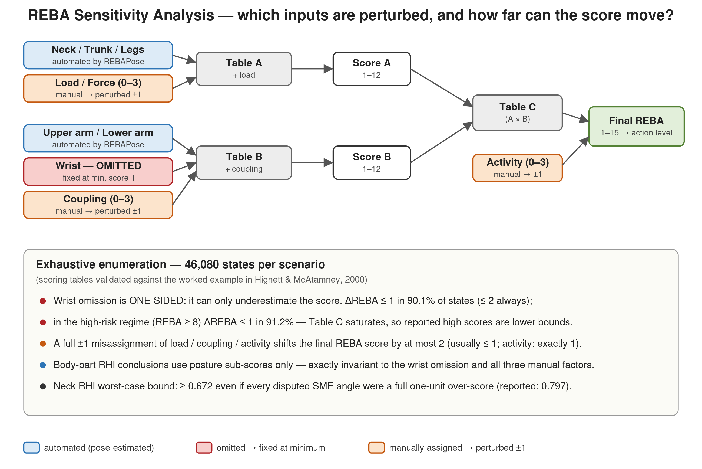

# REBA Sensitivity Analysis — Wrist Omission & Manually Assigned Factors

Quantify exactly how much the final REBA score can move when (a) the wrist component is omitted from automated scoring and (b) the manually assigned load/force, coupling, and activity factors are misassigned — by **exhaustive enumeration** of the complete REBA scoring space, not by sampling or simulation.

REBAPose automates the postural components of REBA from images, but two inputs are not pose-estimated: the **wrist** (2D-to-3D pose lifting provides no wrist orientation, so the wrist score defaults to its minimum of 1) and the **load / coupling / activity** factors (assigned manually per task). This utility answers, with exact arithmetic, the natural question: *how much can these two limitations change the reported scores?*



## Why enumeration works

REBA is a finite lookup-table system:

```
Score A  =  Table A(neck, trunk, legs)          +  load/force  (0-3)
Score B  =  Table B(upper arm, lower arm, wrist) +  coupling    (0-3)
REBA     =  Table C(Score A, Score B)            +  activity    (0-3)
```

The full input space is only **3 neck × 5 trunk × 4 legs × 4 load × 6 upper-arm × 2 lower-arm × 4 coupling × 4 activity = 46,080 states** per scenario. The effect of any input perturbation can therefore be computed exactly for every possible posture-factor combination — no assumptions, no sampling error.

Before any analysis runs, the script **validates its scoring tables against the worked example in the original REBA publication** (Hignett & McAtamney, 2000, p. 205): Table B(UA=3, LA=2, wrist=1) must equal 4, Table C(8, 5) must equal 10, and REBA 11 must map to action level 4. The analysis aborts if any check fails.

## What it analyzes

**1. Wrist omission (one-sided by construction).**
With the wrist fixed at its minimum score (1), the true wrist score can only be equal or higher (2 or 3). The omission therefore can only *underestimate* Score B and the final REBA score — never inflate them. The script enumerates the exact ΔREBA distribution for both true-wrist scenarios, overall and restricted to the high-risk regime (final REBA ≥ 8), where Table C saturation absorbs most of the effect.

**2. Load / coupling / activity misassigned by a full unit.**
Each factor enters REBA additively, so the impact of a ±1 misassignment is bounded and enumerable. The script reports the exact ΔREBA distribution and the fraction of states in which the REBA action level changes.

**3. Neck RHI robustness.**
The Relative Hazard Index for a body region is *linear* in its posture sub-scores (RHI = ΣW / (A·N)), so a one-unit sub-score error in a fraction *p* of postures shifts the RHI by exactly *p*/3. The script computes worst-case RHI bounds under deliberately conservative assumptions (every disputed expert angle treated as a full one-unit error, all in the same direction) and break-even error rates for the body-region ranking.

## Key results

| Perturbation | ΔREBA = 0 | ΔREBA = 1 | ΔREBA = 2 | Max ΔREBA | Action-level changes |
|---|---|---|---|---|---|
| Wrist 1 → 2 | 57.7% | 42.3% | — | 1 | 11.6% |
| Wrist 1 → 3 (worst case) | 44.3% | 45.8% | 9.9% | 2 | 18.0% |
| Load/force +1 | 21.5% | 71.8% | 6.7% | 2 | 22.9% |
| Coupling +1 | 57.2% | 42.8% | — | 1 | 11.8% |
| Activity +1 | — | 100% | — | 1 | 24.7% |

Additional findings:

- **The wrist error is one-directional.** Reported REBA scores are lower bounds; in the high-risk regime (REBA ≥ 8) the underestimate is ≤ 1 in 91.2% of states.
- **Body-part RHI conclusions are exactly invariant** to the wrist omission and to all three manual factors — RHI uses only the posture sub-scores of each region.
- **Neck RHI worst-case bound:** even if every expert-disputed neck angle were a full one-unit over-score, the neck RHI remains ≥ 0.672 — for it to fall below the trunk would require systematic over-scoring in 82.5% of all postures, and falling below the legs or upper arm is mathematically impossible.

## Usage

```bash
pip install numpy
python reba_sensitivity_analysis.py
```

No inputs or configuration are required — the script is fully self-contained (REBA tables are embedded) and prints all results to stdout in four sections: table validation, wrist omission, factor misassignment, and neck RHI robustness.

Example output (excerpt):

```
Table validation against Hignett & McAtamney (2000) worked example: PASSED

========================================================================
(1) WRIST OMISSION (study: wrist fixed at score 1)
========================================================================
Table B increase, wrist 1->2: min 1, max 1 (always +1)
Table B increase, wrist 1->3: min 1, max 2 (mean 1.50)

True wrist score = 2  (46,080 enumerated states)
  Underestimation of final REBA (dREBA): {0: 57.7, 1: 42.3}
  Action-level changes: 11.6%
  Restricted to true REBA >= 8: dREBA {0: 59.9, 1: 40.1}; action-level changes 12.8%
...
```

## Files

| File | Description |
|---|---|
| `reba_sensitivity_analysis.py` | Self-contained analysis script (numpy only) |
| `reba_sensitivity_diagram.png` | Overview of the scoring flow, perturbed inputs, and headline results |

## Extending

The `reba_score()` function and the embedded Tables A/B/C are general-purpose — the same enumeration pattern can stress-test any other REBA input (e.g., a ±1 error in an automated posture sub-score) by perturbing the corresponding argument in `factor_sensitivity()`. The neck-RHI bound in `neck_rhi_sensitivity()` applies to any body region by linearity: a one-unit sub-score error in a fraction *p* of postures shifts that region's RHI by exactly *p*/A.

## Reference

Hignett, S., & McAtamney, L. (2000). Rapid Entire Body Assessment (REBA). *Applied Ergonomics*, 31(2), 201–205.
