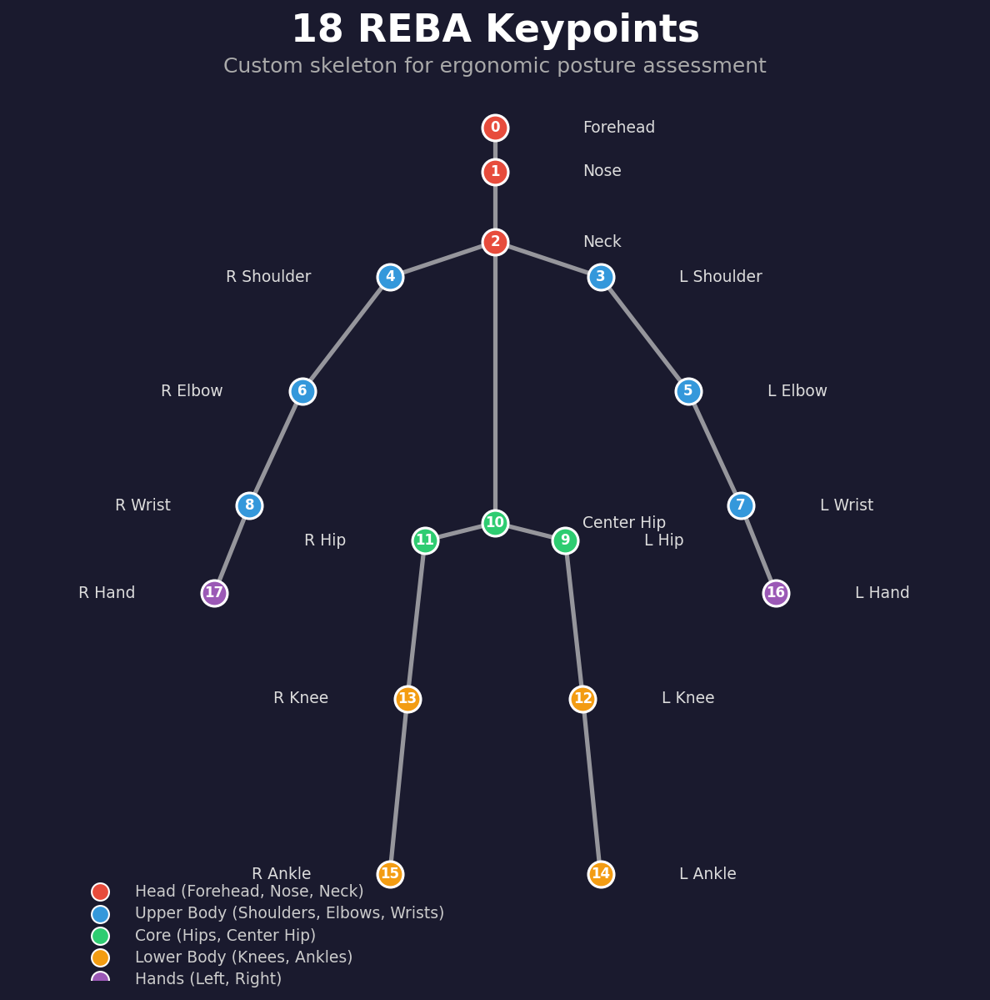

# REBA Keypoint Detection — Custom Pose Model Training

Train a custom 18-keypoint pose estimation model for REBA (Rapid Entire Body Assessment) ergonomic analysis using [MMPose](https://github.com/open-mmlab/mmpose) and HRNet-W32.

Standard COCO pose models detect 17 keypoints (eyes, ears, nose, shoulders, etc.) optimized for general human pose. This training pipeline replaces them with **18 REBA-specific keypoints** designed for occupational ergonomic assessment — removing eyes/ears and adding forehead, center hip, and hand keypoints critical for REBA scoring.



## Custom Keypoint Definition

| ID | Keypoint | ID | Keypoint |
|---|---|---|---|
| 0 | Forehead | 9 | Left Hip |
| 1 | Nose | 10 | Center Hip |
| 2 | Neck | 11 | Right Hip |
| 3 | Left Shoulder | 12 | Left Knee |
| 4 | Right Shoulder | 13 | Right Knee |
| 5 | Left Elbow | 14 | Left Ankle |
| 6 | Right Elbow | 15 | Right Ankle |
| 7 | Left Wrist | 16 | Left Hand |
| 8 | Right Wrist | 17 | Right Hand |

**Skeleton connections:** Forehead-Nose-Neck-CenterHip (spine), Neck branches to shoulders, shoulders to elbows to wrists to hands, CenterHip branches to left/right hips to knees to ankles.

**Key differences from COCO 17-keypoint:**
- Removed: left_eye, right_eye, left_ear, right_ear
- Added: Forehead (head tilt for REBA neck score), Center Hip (trunk angle), Left Hand, Right Hand (wrist/coupling score)

## Prerequisites

- Python >= 3.9
- NVIDIA GPU with CUDA (trained on Kaggle P100; also works on local GPUs like RTX 3050)
- [COCO 2017 dataset](https://cocodataset.org/#download) — download `train2017` and `val2017` image sets
- [COCO-WholeBody annotations](https://github.com/jin-s13/COCO-WholeBody) — `wholebody.json` (train) and `coco_wholebody_val_v1.0.json` (val), used for hand keypoint extraction

### MMPose + MMDetection installation

```bash
pip install openmim
mim install mmcv==2.0.1
git clone https://github.com/open-mmlab/mmdetection.git && cd mmdetection && pip install -e . && cd ..
git clone https://github.com/open-mmlab/mmpose.git && cd mmpose && pip install -e . && cd ..
```

## Pipeline Overview


The training has two stages:

```
Stage 1: Generate REBA annotation JSONs
  Per-person JSONs  +  COCO-WholeBody  -->  rebatrain_keypoints.json / rebaval_keypoints.json

Stage 2: Train HRNet-W32 model
  rebatrain_keypoints.json  +  COCO images  -->  COCO format  -->  MMPose training  -->  best_model.pth
```

## Stage 1 — Generate REBA Annotation JSONs

### Input

- `data/ann/jsons/jsons-23-46/` — Per-person annotation JSONs (~149,813 files for training). Each JSON contains:

```json
{
  "image_id": "100010",
  "json_name": "100010.json",
  "key_points": {
    "forehead": [142, 207, 2],
    "nose": [0, 0, 0],
    "neck": [146, 221, 2],
    "left_shoulder": [154, 225, 2],
    ...
  }
}
```

Each keypoint is `[x, y, visibility]` where visibility: 0 = not labeled, 1 = labeled but occluded, 2 = labeled and visible.

- `wholebody.json` — COCO-WholeBody train annotations (for hand keypoint extraction)
- `coco_wholebody_val_v1.0.json` — COCO-WholeBody val annotations

### Process

The notebook `hrnet_reba_dataset_generate.ipynb` performs:

1. Loads per-person annotation JSONs (custom REBA keypoints)
2. Removes eye and ear keypoints (not needed for REBA)
3. Matches each annotation to the COCO-WholeBody record by `image_id`
4. Extracts the highest-confidence hand keypoint from the wholebody hand annotations
5. Appends left_hand and right_hand keypoints to the REBA keypoint list
6. Outputs `rebatrain_keypoints.json` with all annotations merged

Run `hrnet_reba_dataset_generate_Val.ipynb` for validation data (produces `rebaval_keypoints.json`).

### Output

- `rebatrain_keypoints.json` — Training annotations (~149,813 person instances)
- `rebaval_keypoints.json` — Validation annotations (~6,352 person instances)

## Stage 2 — Train HRNet-W32 Model

### Input

- `rebatrain_keypoints.json` (from Stage 1)
- COCO `train2017/` and `val2017/` images (downloaded separately)

### Process

The notebook `mmposehrnet-v4.ipynb` performs:

1. **Install dependencies** — MMPose, MMDetection, mmcv
2. **Convert to COCO format** — Reads `rebatrain_keypoints.json`, builds standard COCO annotation structure with 18 keypoints, bounding boxes, and image metadata
3. **Train/test split** — 97% trainval / 3% test (seed=2023)
4. **Write MMPose config** — Generates `reba_keypoint.py` with custom keypoint definitions, skeleton, and training hyperparameters
5. **Train** — Runs MMPose `train.py` with HRNet-W32 backbone (pretrained on ImageNet)

### Training Configuration

| Parameter | Value |
|---|---|
| Backbone | HRNet-W32 (ImageNet pretrained) |
| Input size | 192 x 256 |
| Heatmap size | 48 x 64 |
| Codec | MSRAHeatmap (sigma=2) |
| Optimizer | AdamW (lr=0.005, weight_decay=0.05) |
| Scheduler | LinearLR warmup (600 iters) + CosineAnnealing |
| Batch size | 128 (train) / 32 (val) |
| Epochs | 240 (with stage 2 augmentation switch at epoch 230) |
| Seed | 2023 |
| Checkpoint | Best PCK saved, max 2 kept |

### Data Augmentations

**Stage 1 (epochs 1-230):** RandomFlip, RandomBBoxTransform (scale 0.8-1.2, rotate 30), YOLOXHSVRandomAug, Albumentation (ChannelShuffle, CLAHE, ColorJitter, CoarseDropout)

**Stage 2 (epochs 230-240):** RandomHalfBody, stronger RandomBBoxTransform (scale 0.75-1.25, rotate 60), Blur, MedianBlur, CoarseDropout

### Evaluation Metrics

- CocoMetric (AP/AR)
- PCK Accuracy (threshold=0.2)
- AUC
- NME (normalized by Forehead-Nose distance)

### Running on Kaggle

Upload this folder as a Kaggle dataset. In a Kaggle notebook:

```python
# Cell 1: Install MMPose + MMDetection (see mmposehrnet-v4.ipynb cell 0)
# Cell 2: Set paths
IMAGE_PATH = 'train2017'          # COCO train images
JSON_PATH  = 'reba_trainDataCoco.json'  # from Stage 1
# Cell 3-4: Convert to COCO format + split
# Cell 5: Write config + train
!python mmpose/tools/train.py configs/reba_keypoint.py
```

### Running Locally

```bash
# Prepare data directory
mkdir -p data/images
# Symlink or copy COCO images into data/images/
ln -s /path/to/coco/train2017/* data/images/
ln -s /path/to/coco/val2017/* data/images/

# Generate COCO-format annotations (run the conversion cells from mmposehrnet-v4.ipynb)
# This produces data/trainval.json and data/test.json

# Train
python mmpose/tools/train.py data/config/reba_keypoint.py
```

### Output

- `work_dir/best_model.pth` — Best checkpoint by PCK metric
- `work_dir/` — Training logs, intermediate checkpoints

## Customizing Keypoints

To train with different keypoints (e.g., adding new body landmarks or changing the skeleton):

1. **Update annotation JSONs** — Modify `hrnet_reba_dataset_generate.ipynb` to include/exclude keypoints from the `key_points` dict
2. **Update config** — In `data/config/reba_keypoint.py`, modify:
   - `NUM_KEYPOINTS` — total keypoint count
   - `keypoint_info` — name, ID, color, swap pairs for each keypoint
   - `skeleton_info` — which keypoints connect (bones)
   - `sigmas` — OKS sigma per keypoint (controls evaluation strictness)
   - `joint_weights` — per-keypoint loss weighting
   - `out_channels` in the `head` config — must equal `NUM_KEYPOINTS`
3. **Update COCO conversion** — In `mmposehrnet-v4.ipynb`, update the `categories` keypoint list and skeleton definition
4. **Retrain** — Run the training pipeline with the updated config

## Directory Structure

```
REBAJsonTrg/
  README.md
  hrnet_reba_dataset_generate.ipynb      # Stage 1: generate training annotation JSON
  hrnet_reba_dataset_generate_Val.ipynb  # Stage 1: generate validation annotation JSON
  mmposehrnet-v4.ipynb                   # Stage 2: COCO conversion + MMPose training
  COCOValidation_GT.json                 # COCO validation ground truth reference
  data/
    config/
      reba_keypoint.py                   # MMPose training config (18 REBA keypoints)
    ann/
      jsons/
        jsons-23-46/                     # Per-person annotation JSONs (~149K files)
    images/                              # COCO images (not included — download separately)
  work_dir/                              # Training outputs (checkpoints, logs)
```

## References

1. Hignett S, McAtamney L. Rapid Entire Body Assessment (REBA). *Applied Ergonomics* 2000;31:201-205.
2. Sun K, et al. Deep High-Resolution Representation Learning for Human Pose Estimation. *CVPR* 2019.
3. Lin TY, et al. Microsoft COCO: Common Objects in Context. *ECCV* 2014.
4. Jin S, et al. Whole-Body Human Pose Estimation in the Wild. *ECCV* 2020.
5. MMPose Contributors. OpenMMLab Pose Estimation Toolbox. https://github.com/open-mmlab/mmpose

## License

This project is licensed under the [MIT License](../LICENSE).

## Citation

Citation details will be added after publication.
