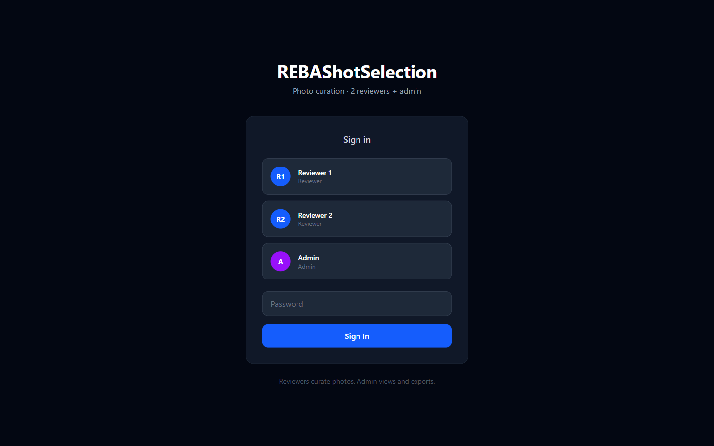
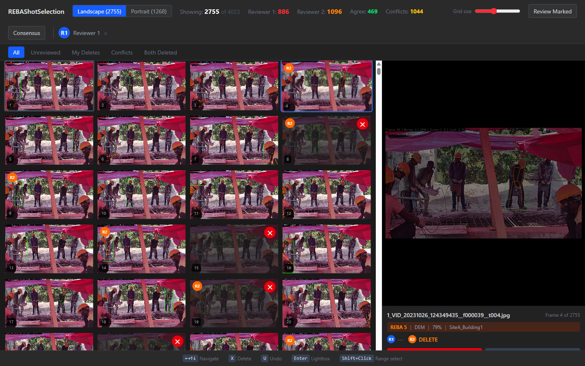
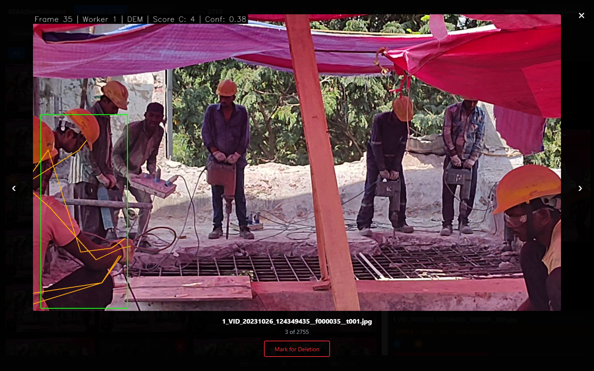
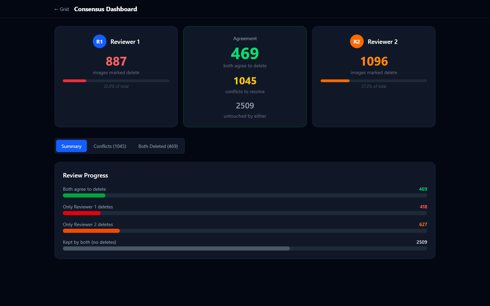

# REBAShotSelection

A web-based image review tool for curating video frames before ergonomic (REBA) assessment. Two independent reviewers mark irrelevant or poor-quality frames for deletion; a consensus dashboard compares their decisions. Only frames that survive this review proceed to downstream REBA analysis.

## Context

This tool is part of a larger pipeline for automated ergonomic risk assessment of construction workers from video footage:

1. **Video sampling** (see `SamplingFrames_from_videos/`) extracts candidate frames from field videos
2. **REBA scoring** (see `REBAPose/`) computes Rapid Entire Body Assessment scores via pose estimation
3. **Frame curation** (this tool) provides a UI for domain experts to remove invalid frames before final analysis

The curation step is necessary because automated frame extraction inevitably includes frames where workers are partially occluded, not performing the target activity, or captured at angles unsuitable for pose estimation. Human review ensures only valid frames enter the ergonomic assessment pipeline.

## Features

- **Virtual-scrolled grid** of all extracted frames (4,023 in our study) with no pagination
- **Two-reviewer workflow** with independent deletion marking and cross-visibility (see the other reviewer's marks via badges)
- **Keyboard-first navigation**: arrow keys to move, `X` to mark for deletion, `U` to undo, `Enter` for full-screen lightbox
- **Batch operations**: Ctrl+Click for multi-select, Shift+Click for range select
- **Orientation tabs**: separate Landscape and Portrait views for uniform grid layout
- **Filter tabs**: All, Unreviewed, My Deletes, Conflicts, Both Deleted
- **Consensus dashboard**: visual comparison of both reviewers' decisions with conflict resolution
- **Admin role**: read-only view with CSV export of all review decisions
- **Persistent state**: all decisions saved to Google Cloud Firestore in real time

### Login



### Review Grid



### Lightbox



### Consensus Dashboard



## Architecture

| Layer | Technology |
|-------|-----------|
| Frontend | React 19 + TypeScript + TailwindCSS 4 |
| Build | Vite 8 |
| Virtual scroll | @tanstack/react-virtual |
| Backend | Express.js (Node.js) |
| Database | Google Cloud Firestore |
| Image storage | Google Cloud Storage |
| Deployment | Docker / GCP Cloud Run |

### Application structure

```
REBAShotSelection/
├── src/
│   ├── App.tsx                    # Router (/, /review, /consensus)
│   ├── store.ts                   # Global state (votes, photos, user)
│   ├── mockData.ts                # Photo data + offline fallback
│   ├── api.ts                     # Backend API client
│   ├── components/
│   │   ├── GridCell.tsx           # Memoized image cell with badges
│   │   ├── Lightbox.tsx           # Full-screen image overlay
│   │   └── ShortcutBar.tsx        # Keyboard shortcut reference bar
│   ├── hooks/
│   │   ├── useColumnCount.ts      # Responsive column calculation
│   │   └── useGridKeyboard.ts     # 2D arrow key navigation
│   └── pages/
│       ├── Login.tsx              # Reviewer profile selection
│       ├── ReviewGrid.tsx         # Main review grid with virtual scroll
│       └── Consensus.tsx          # Dashboard comparing reviewer decisions
├── server/
│   ├── index.ts                   # Express API server (auth, photos, votes)
│   └── seed.ts                    # Firestore seeding from CSV + vote JSON
├── e2e/                           # Playwright end-to-end tests
├── tests/                         # Integration tests
├── REBA_finalSelected.csv         # Frame metadata with REBA scores
├── Reviewer_User_Manual.md        # Step-by-step guide for reviewers
├── Dockerfile                     # Multi-stage production build
└── .env.example                   # Required environment variables
```

## Prerequisites

- **Node.js** >= 18 (tested with Node 22)
- **npm** >= 9
- **Google Cloud project** with Firestore and Cloud Storage enabled (for production)
- **Frame images**: JPEG files from the upstream sampling pipeline, stored locally or in a GCS bucket

## Setup

### 1. Clone and install dependencies

```bash
cd REBAShotSelection
npm install
```

### 2. Configure environment variables

```bash
cp .env.example .env
```

Edit `.env` and set at minimum:

| Variable | Purpose | Required |
|----------|---------|----------|
| `REVIEWER1_PASSWORD` | Login password for Reviewer 1 | Yes |
| `REVIEWER2_PASSWORD` | Login password for Reviewer 2 | Yes |
| `ADMIN_PASSWORD` | Login password for Admin | Yes |
| `SESSION_SECRET` | HMAC signing key for auth tokens | Yes |
| `GCS_BUCKET` | GCS bucket name containing frame images | For production |
| `FRAMES_DIR` | Local path to frame images (dev server only) | For local dev |

### 3. Prepare frame images

The app serves frame images from one of two sources:

- **Local development**: Place your annotated frame JPEGs in a `frames_annotated/` directory (or set `FRAMES_DIR` in `.env`). The Vite dev server will serve them at `/frames/<filename>`.
- **Production**: Upload frames to a GCS bucket and set `GCS_BUCKET` in your environment. The Express server constructs URLs as `https://storage.googleapis.com/<bucket>/frames_annotated/<filename>`.

### 4. Seed the database (production only)

If using Firestore, seed the photo catalog and optionally import existing reviewer votes:

```bash
# Seed photos from CSV
npx tsx server/seed.ts <reviewer1_votes.json> <reviewer2_votes.json>
```

Vote files should be JSON objects where keys are photo IDs and values have `{delete: true/false}`.

## Running

### Development (with hot reload)

Start both the Vite dev server and the Express backend:

```bash
# Terminal 1: Frontend (port 5173)
npm run dev

# Terminal 2: Backend API (port 3001)
npm run dev:server
```

Open `http://localhost:5173` in your browser.

**Offline mode**: If the backend is not running, the app falls back to mock data with placeholder images. This is useful for UI development.

### Production

```bash
npm run build
npm start
```

The Express server serves both the API and the built frontend on port 8080 (configurable via `PORT`).

### Docker

```bash
docker build -t rebashotselection .
docker run -p 8080:8080 \
  -e REVIEWER1_PASSWORD=your_password \
  -e REVIEWER2_PASSWORD=your_password \
  -e ADMIN_PASSWORD=your_password \
  -e SESSION_SECRET=your_secret \
  -e GCS_BUCKET=your_bucket \
  rebashotselection
```

### Deploy to GCP Cloud Run

```bash
gcloud run deploy rebashotselection \
  --source . \
  --region continent-direction1 \
  --allow-unauthenticated \
  --set-env-vars "REVIEWER1_PASSWORD=...,REVIEWER2_PASSWORD=...,ADMIN_PASSWORD=...,SESSION_SECRET=...,GCS_BUCKET=..."
```

## Usage

See [Reviewer_User_Manual.md](Reviewer_User_Manual.md) for a step-by-step guide with keyboard shortcuts and workflow recommendations.

### Quick start

1. Open the app and sign in as Reviewer 1 or Reviewer 2
2. Navigate the photo grid using **arrow keys**
3. Press **X** to mark a frame for deletion, **U** to undo
4. Press **Enter** to open a frame in full-screen lightbox
5. Use **Ctrl+Click** or **Shift+Click** for batch selection
6. Visit the **Consensus** dashboard to compare decisions with the other reviewer
7. Admin can export all decisions as CSV

### Keyboard shortcuts

| Key | Grid | Lightbox |
|-----|------|----------|
| Arrow keys | Navigate grid | Previous/next image |
| X | Mark for deletion | Toggle deletion |
| U | Undo deletion | - |
| Enter | Open lightbox | - |
| Escape | Clear selection | Close lightbox |

## Testing

```bash
# Unit tests (26 tests covering store operations)
npm test

# End-to-end tests (requires dev server running)
npm run test:e2e

# All tests
npm run test:all
```

## Data files

| File | Description |
|------|-------------|
| `REBA_finalSelected.csv` | Master frame list with REBA ergonomic scores (Score A/B/C, load factor, activity score) |
| `src/selected_frames_tasks_rebascores.csv` | Extended frame metadata used to seed the Firestore database |
| `src/rebaScores.json` | REBA score lookup keyed by frame filename |
| `src/photoFilenames.json` | Ordered list of all frame filenames |
| `src/bbData.json` | Bounding box dimensions (image width/height) per frame |

## CSV output format

The admin CSV export (`rebashotselection-export-YYYY-MM-DD.csv`) contains:

```csv
photo_id,filename,reviewer1_delete,reviewer2_delete
0,1_VID_20231026_123736025__f000070__t001.jpg,false,false
1,1_VID_20231026_123736025__f000249__t001.jpg,true,false
5,1_VID_20231026_123736025__f000832__t002.jpg,true,true
```

Use the `reviewer1_delete` and `reviewer2_delete` columns to filter frames for downstream REBA analysis.

## License

MIT
