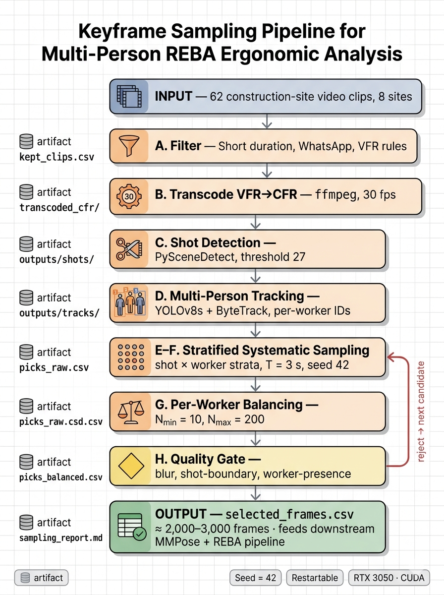

# Keyframe Sampling Pipeline for Multi-Person REBA Ergonomic Analysis

A two-part pipeline for selecting statistically defensible keyframes from construction/demolition site video footage and computing per-worker REBA (Rapid Entire Body Assessment) ergonomic risk scores.

**Part A** samples representative frames from a video corpus using stratified systematic sampling with multi-person tracking, per-worker balancing, and quality gating.  
**Part B** runs pose estimation and REBA scoring on each selected frame, producing annotated images and structured risk data.

## Pipeline Overview



*Each phase writes a durable artifact, so any phase is independently restartable. Rejected frames at the quality gate are replaced by the next valid candidate in the same stratum.*

## Prerequisites

### Hardware

- NVIDIA GPU with CUDA support (tested on RTX 3050 Laptop, 4 GB VRAM)
- Sufficient disk space for video corpus and extracted frames

### Software

| Dependency | Purpose |
|---|---|
| Python >= 3.9 | Runtime (tested on 3.9, 3.10, 3.11) |
| PyTorch (CUDA) | GPU inference for detection and tracking |
| [Ultralytics](https://github.com/ultralytics/ultralytics) | YOLOv8s detection + ByteTrack multi-person tracking |
| [PySceneDetect](https://github.com/Breakingtaps/PySceneDetect) | Shot boundary detection (ContentDetector) |
| OpenCV (`cv2`) | Frame extraction, blur detection, image I/O |
| pandas, numpy, tqdm | Data manipulation and progress bars |
| FFmpeg (on PATH) | VFR-to-CFR transcoding |
| REBAPose (see `../REBAPose/` in this repo) | REBA scoring + 2D pose estimation (Part B only) |

### Installation

```bash
pip install -r requirements.txt
```

### Verify CUDA availability

```bash
python -c "import torch; print(torch.cuda.is_available())"  # must print True
```

### Verify FFmpeg

```bash
ffmpeg -version
```

## Input Data

Prepare your video corpus in the following structure:

```
<VIDEO_ROOT>/
  <Site_1_Folder>/
      video_clip_1.mp4
      video_clip_2.mp4
      ...
  <Site_2_Folder>/
      ...
```

Create a master metadata CSV (`video_analysis.csv`) containing at minimum:

| Column | Description |
|---|---|
| `Foldername` | Site folder name (e.g., `1_26102023_SiteA_Building1`) |
| `Filename` | Video file name (e.g., `VID_20231026_123736025.mp4`) |
| `duration_s` | Clip duration in seconds |
| `fps` | Frames per second |
| `vfr` | `True` if variable frame rate |
| `width`, `height` | Resolution |
| `bitrate_kbps` | Bitrate in kbps |

> See [`sample_video_analysis.csv`](sample_video_analysis.csv) for a complete example with all columns.

You can generate this CSV automatically using the included `build_csv.py` utility:

```bash
# Scan default folder list under a given root
python build_csv.py --root /path/to/video/corpus

# Custom output path
python build_csv.py --root /path/to/video/corpus --output metadata.csv

# Scan specific folders only
python build_csv.py --root /path/to/video/corpus --folders "1_SiteA" "2_SiteB"
```

> **Note:** Edit the `FOLDERS` list in `build_csv.py` to match your site folder names, or pass them via `--folders`.

## Part A -- Keyframe Sampling (`sample_frames.py`)

Selects representative frames from a video corpus using a statistically principled sampling design.

### Design Principles

1. **Representativeness** -- frames proportionally cover all activities, workers, and sites
2. **Independence** -- sampled frames are not temporally adjacent, avoiding auto-correlation
3. **Unbiased coverage of peak exertion** -- short, high-load events (lifting, striking) are not systematically missed
4. **Reproducibility** -- fixed random seed (42) reproduces the exact frame list

### Pipeline Phases

The script runs in phases. Each phase reads the previous phase's artifact and writes its own, so the pipeline is **restartable** at any point.

```bash
python sample_frames.py --phase {filter|transcode|shots|track|sample|balance|validate|report|all} \
    [--root /path/to/video/corpus] [--work /path/to/working/dir]
```

- `--root`: Root directory containing site video folders (default: parent of script directory)
- `--work`: Working directory for `video_analysis.csv` and `outputs/` (default: script directory)

| Phase | What It Does | Artifact Written |
|---|---|---|
| `filter` | Applies clip-level inclusion/exclusion rules | `outputs/kept_clips.csv`, `outputs/excluded_clips.csv` |
| `transcode` | Converts VFR clips to CFR at 30 fps via FFmpeg | `transcoded_cfr/*.mp4` |
| `shots` | Detects shot boundaries using PySceneDetect (threshold=27) | `outputs/shots/{stem}.csv` |
| `track` | Runs YOLOv8s + ByteTrack multi-person tracking | `outputs/tracks/{stem}.jsonl` |
| `sample` | Stratified systematic sampling (T=3s, seed=42) | `outputs/picks_raw.csv` |
| `balance` | Enforces per-worker quotas (N_min=10, N_max=200) | `outputs/picks_balanced.csv` |
| `validate` | Quality gate: blur, shot-boundary, worker-presence checks | `outputs/selected_frames.csv` |
| `report` | Generates summary statistics for the Methods section | `outputs/sampling_report.md` |
| `all` | Runs every phase in order | All of the above |

### Clip-Level Filters (Phase: `filter`)

| Rule | Action | Rationale |
|---|---|---|
| Duration < 10 s | Drop | Almost always framing / test shots |
| 10 s <= Duration < 30 s | Keep only if worker-present > 50% | Preserve peak-exertion short clips |
| WhatsApp origin (`*WA*`, 720x1280, bitrate < 3 Mbps) | Drop | Lossy re-encode degrades pose keypoints |
| VFR = yes | Transcode to CFR (30 fps) | Frame index <-> timestamp alignment |
| Worker bbox height < 80 px | Mark frame invalid | Pose unreliable at this resolution |

### Sampling Method

**Strata** are defined as the Cartesian product: `{shot_i} x {worker_track_j}`.

Within each stratum, systematic sampling with random start is applied:
- Sampling interval: T = 3 seconds (~90 frames at 30 fps)
- Random start: `u ~ Uniform(0, T)`, RNG seeded at 42
- Picks: `{u + i*T | i = 0, 1, ..., k-1}` where `k = max(1, floor(L/T))`

Per-worker balancing then enforces quotas (N_min=10, N_max=200) to ensure multi-person fairness.

### Quality Gate (Phase: `validate`)

Applied after sampling; rejected frames are replaced by the next valid systematic pick in the same stratum.

1. **Blur**: Laplacian variance >= 100 (via `cv2.Laplacian(...).var()`)
2. **Not a scene cut**: frame index >= 5 frames from any PySceneDetect boundary
3. **Worker present**: YOLOv8 person confidence >= 0.5, bbox height >= 80 px

### Usage Examples

```bash
# Run the entire pipeline end-to-end (videos in parent directory)
python sample_frames.py --phase all

# Point to a custom video corpus location
python sample_frames.py --phase all --root /data/site_videos --work /data/analysis

# Run only the tracking phase on a specific clip
python sample_frames.py --phase track --only "VID_20231026_*"

# Run phases individually (recommended for first run)
python sample_frames.py --phase filter
python sample_frames.py --phase transcode
python sample_frames.py --phase shots
python sample_frames.py --phase track
python sample_frames.py --phase sample
python sample_frames.py --phase balance
python sample_frames.py --phase validate
python sample_frames.py --phase report
```

### Output: `selected_frames.csv`

The final deliverable with columns:

| Column | Description |
|---|---|
| `clip_path` | Path to the video file |
| `folder` | Site folder name |
| `sitename` | Site name |
| `frame_idx` | 0-based frame index |
| `timestamp_s` | Timestamp in seconds |
| `shot_id` | Shot segment identifier |
| `track_id` | Per-clip worker track ID |
| `bbox_x`, `bbox_y`, `bbox_w`, `bbox_h` | Worker bounding box coordinates |
| `motion_score` | Motion score |
| `blur_score` | Laplacian variance (blur metric) |
| `reason` | Why this frame was selected |

Expected yield: ~2,000--3,000 frames from a 2-hour active footage corpus.

---

## Part B -- REBA Scoring (`dump_all_selected_frames.py`)

Takes the `selected_frames.csv` (or any CSV manifest with worker bounding boxes) and:
1. Extracts each frame from the source video
2. Optionally annotates with bounding boxes and captions
3. Optionally runs REBAPose for full REBA ergonomic scoring with skeleton overlay

### Flags

| Flag | Description |
|---|---|
| `--csv <path>` | Input CSV manifest (default: `outputs/selected_frames.csv`) |
| `--out <path>` | Output directory for extracted frames (default: `outputs/frames`) |
| `--format {jpg\|png}` | Image format (default: `jpg`) |
| `--jpg-quality <1-100>` | JPEG quality (default: 95) |
| `--annotate` | Draw green bounding box + caption on each frame |
| `--crop` | Save bbox crop (with 10% padding) instead of full frame |
| `--bbox-only` | Draw green bounding box only (no caption, no skeleton) |
| `--reba` | Run REBAPose REBA scoring + skeleton overlay (requires REBAPose venv) |
| `--site <substring>` | Filter by site name / folder substring |
| `--overwrite` | Re-extract even if output file already exists |
| `--dry-run` | Print extraction plan without writing files |

### Usage Examples

```bash
# Basic frame extraction
python dump_all_selected_frames.py --csv selected_frames_tasks.csv

# Annotated frames with bounding boxes and captions
python dump_all_selected_frames.py --csv selected_frames_tasks.csv --annotate

# Cropped + annotated frames
python dump_all_selected_frames.py --csv selected_frames_tasks.csv --crop --annotate

# Full REBA scoring with skeleton overlay (requires REBAPose venv)
python dump_all_selected_frames.py --csv selected_frames_tasks.csv --annotate --reba

# Extract frames for a specific site only
python dump_all_selected_frames.py --site "1_" --jpg-quality 92

# Preview what will be extracted
python dump_all_selected_frames.py --dry-run
```

### Filename Convention

Each extracted frame follows this naming pattern:

```
{stem_id}__f{frame_idx:06d}__t{track_id:03d}.jpg
```

Example: `1_VID_20231026_123736025__f001234__t003.jpg`

### REBA Integration (`--reba` flag)

When the `--reba` flag is enabled, each frame is processed through REBAPose for full-body ergonomic assessment:

**How it works:**
1. REBAPose runs 2D pose estimation on the full frame (all detected persons)
2. IoU matching identifies which detected person corresponds to the CSV bounding box
3. Only the matched person's skeleton is drawn on the output image
4. REBA scores are computed for the matched person

**Skeleton overlay:**
- Risk-colored skeleton lines: green (low risk), orange (medium), red (high risk)
- Caption format: `Frame N | Worker N | Task | Score C: X | Conf: Y`

**Outputs when `--reba` is active:**

| Output | Description |
|---|---|
| Annotated frames | Full-frame images with skeleton overlay in `--out` directory |
| `jsons/` subfolder | Per-frame REBA JSON files containing keypoints, keypoints_3d, and full REBA score breakdown |
| Updated CSV | `selected_frames_tasks_rebascores.csv` with added `ScoreC` and `Confidence` columns |

**REBA JSON structure** (per frame, in `jsons/` subfolder):

```json
{
  "keypoints": {"nose": [x, y], "left_shoulder": [x, y], ...},
  "keypoints_3d": {"nose": [x, y, z], ...},
  "keypoint_scores": {"nose": 0.95, ...},
  "reba": {
    "aggregateScore": {"ScoreA": 5, "ScoreB": 4, "ScoreC": 7},
    "bodyPartScores": {
      "trunk": 3, "neck": 2, "legs": 2,
      "upperArm": 3, "lowerArm": 2, "wrist": 1
    }
  }
}
```

> **Note:** The `--reba` flag requires the REBAPose module (located at `../REBAPose/` in this repository) and its dependencies (PyTorch with CUDA, MMPose). See [REBAPose Setup](#rebapose-setup) below.

### REBAPose Setup

The REBA scoring module (`../REBAPose/`) requires a Python environment with pose estimation dependencies installed (PyTorch, MMPose, etc.). The script automatically imports REBAPose from the parent directory.

```bash
# Ensure REBAPose dependencies are installed, then run:
python dump_all_selected_frames.py --csv selected_frames_tasks.csv --annotate --reba
```

Refer to the `REBAPose/` directory in the repository root for its own setup instructions and dependencies.

---

## Directory Structure

```
<repo_root>/
  REBAPose/                         # REBA pose estimation module (separate folder)
  SamplingFrames_from_videos/       # <-- this folder
    README.md
    LICENSE
    requirements.txt
    .gitignore
    build_csv.py                    # Utility: build video_analysis.csv via ffprobe
    sample_frames.py                # Part A: keyframe sampling pipeline
    dump_all_selected_frames.py     # Part B: frame extraction + REBA scoring
    Video_Sampling_workflow.png     # Pipeline flowchart
    video_analysis.csv              # Master metadata (generated by build_csv.py)
    transcoded_cfr/                 # VFR clips re-encoded to 30 fps CFR
    outputs/
      kept_clips.csv                # Clips passing inclusion filters
      excluded_clips.csv            # Dropped clips with exclusion reasons
      shots/
        {stem}.csv                  # Shot boundaries per clip
      tracks/
        {stem}.jsonl                # Per-frame person detections + track IDs
      picks_raw.csv                 # Raw systematic sampling picks
      picks_balanced.csv            # After per-worker quota balancing
      selected_frames.csv           # FINAL deliverable: sampled frames
      sampling_report.md            # Summary statistics for Methods section
      frames/                       # Extracted frame images
        jsons/                      # Per-frame REBA JSON files (when --reba)
    selected_frames_tasks_rebascores.csv  # CSV with REBA Score C + Confidence
```

---

## Reproducibility

- **Random seed**: 42 (fixed across all stochastic operations)
- **Deterministic phases**: each phase reads the previous artifact and writes its own, so re-running produces identical results
- **Restartable**: every phase skips work whose output file already exists; safe to interrupt and resume

---

## Known Limitations

1. **Camera angle**: 2D pose from oblique handheld cameras introduces angle-estimation error; trunk and shoulder angles are more reliable than knee and ankle.
2. **Per-clip identity**: Track IDs are per-clip, not cross-clip. The same physical worker in two clips gets different IDs unless global ReID (OSNet + HDBSCAN) is enabled.
3. **Aliasing risk**: Systematic sampling assumes no periodicity at exactly the sampling rate. The random start mitigates but does not eliminate this.
4. **Clip exclusion coverage**: WhatsApp / short-clip exclusion may remove entire site-days; the sampling report enumerates which.

---

## References

1. Takala E-P, et al. Systematic evaluation of observational methods assessing biomechanical exposures at work. *Scand J Work Environ Health* 2010;36(1):3--24.
2. David GC. Ergonomic methods for assessing exposure to risk factors for work-related musculoskeletal disorders. *Occup Med* 2005;55(3):190--199.
3. Hignett S, McAtamney L. Rapid Entire Body Assessment (REBA). *Applied Ergonomics* 2000;31:201--205.
4. McAtamney L, Corlett EN. RULA: a survey method for the investigation of work-related upper limb disorders. *Applied Ergonomics* 1993;24(2):91--99.
5. Cochran WG. *Sampling Techniques*, 3rd ed. Wiley, 1977 (Ch. 8).
6. Zhang Y, et al. ByteTrack: Multi-Object Tracking by Associating Every Detection Box. *ECCV* 2022.
7. Aharon N, et al. BoT-SORT: Robust Associations Multi-Pedestrian Tracking. arXiv:2206.14651, 2022.
8. Zhou K, et al. Omni-Scale Feature Learning for Person Re-Identification. *ICCV* 2019.
9. Jocher G, et al. Ultralytics YOLOv8. https://github.com/ultralytics/ultralytics, 2023.
10. Castellano B. PySceneDetect. https://github.com/Breakingtaps/PySceneDetect.
11. Pech-Pacheco JL, et al. Diatom autofocusing in brightfield microscopy: a comparative study. *ICPR* 2000.
12. Plantard P, et al. Validation of an ergonomic assessment method using Kinect data in real workplace conditions. *Applied Ergonomics* 2017;65:474--482.

---

## License

This project is licensed under the [MIT License](LICENSE).

## Citation

Citation details will be added after publication.
